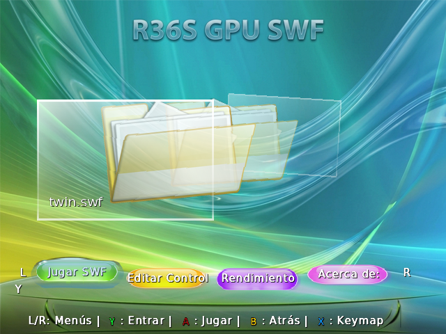

# AeroFlash

A Flash (.swf) player for the R36S with real GPU acceleration (Mali-G31 via DRM/GBM/EGL), built on Ruffle and adapted from the ruffle-miyooflip port. Avoids the freezing caused by software rendering fallback that the official Ruffle player runs into on this hardware.
This application has only been tested on the dArkOS R36S system. Any variations would need to be within the RK3326 SoC platform or ARM Linux 4.19 kernel.

## Installation

1. Download the [ZIP](https://github.com/CraftyAdeptness/AERO-FLASH-R36S/releases) from the latest Release.
2. Extract the contents into `/roms/ports/` on your SD card (EASYROMS partition or other custom dir with chmod permition ).
3. Restart EmulationStation optional.
4. AeroFlash will show up under the "Ports" section.

## Controls

| Button | Action |
|-------|--------|
| A | Confirm |
| B | Back out of menu/submenu |
| X | Edit keymap for the selected .swf  |
| Y | Enters the submenu  |
| L/R | switches the submenu between Play, Edit Controls, Performance and About |
| Select + Start | Exit AeroFlash |

## Credits

- [Ruffle](https://github.com/ruffle-rs/ruffle) — Flash engine
- [ruffle-miyooflip](https://github.com/aweigit/ruffle-miyooflip) — DRM/GBM/EGL rendering base adapted for this port
